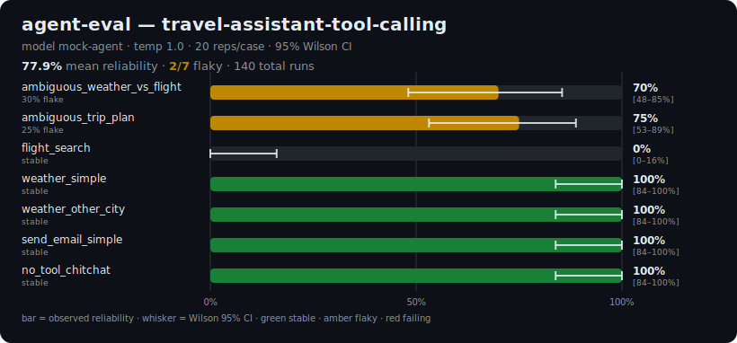

# agent-eval

[](https://github.com/manishgk/agent-eval/actions/workflows/eval.yml)
[](LICENSE)
[](pyproject.toml)
[](https://github.com/astral-sh/ruff)
[](pyproject.toml)

**QA discipline for non-deterministic AI.** `agent-eval` runs each LLM test case
many times, then reports **reliability**, **flake rate**, **confidence intervals**,
and **pass^k** — so you can see *how consistently* an LLM agent does the right
thing, not just whether it worked once.

The demo domain is **agent tool-calling reliability**: given a prompt, does the
agent call the *right tool with the right arguments* — and how reliably across 20+
runs at temperature 1.0?

<p align="center">
  
</p>

*Each bar is one prompt run 20× at temperature 1.0. Green = rock-solid, amber =
flaky. The whisker is the 95% Wilson CI — note how wide it stays even at 20 runs.*

---

## 🎯 Why this exists

A single passing run tells you almost nothing about an LLM feature. The same
prompt at temperature > 0 can pick the right tool 19 times and a wrong one the
20th. Traditional test suites treat that as a "flaky test" to be silenced;
`agent-eval` treats flakiness as **the signal** and measures it directly.

> Example: the prompt *"Plan my trip to NYC next Friday"* picks the right first
> action **17/20** times → **85% reliability, 15% flake rate, 95% CI [64%, 95%]**.
> The wide interval is the point: 20 runs is not enough to call this production-ready.

## 🤖 AI features showcased

| Feature | Where |
| --- | --- |
| **Claude agentic tool-use** — agent selects from a tool registry via the Messages API | [`agent/tool_agent.py`](src/agent_eval/agent/tool_agent.py), [`providers/anthropic.py`](src/agent_eval/providers/anthropic.py) |
| **LLM-as-a-judge** — Claude grades ambiguous cases against a rubric using *forced tool use* for schema-valid verdicts | [`eval/judge.py`](src/agent_eval/eval/judge.py) |
| **Statistical reliability engine** — Wilson confidence intervals, flake rate, pass^k | [`eval/stats.py`](src/agent_eval/eval/stats.py) |
| **Async repeat engine** — bounded-concurrency N-run executor with retry/backoff | [`eval/runner.py`](src/agent_eval/eval/runner.py) |
| **JSON Schema for evalset YAML** — IDE autocomplete/validation, kept in sync via CI | [`evalsets/schema/eval_suite.schema.json`](evalsets/schema/eval_suite.schema.json), [`scripts/export_schema.py`](scripts/export_schema.py) |

## 🏗️ Architecture

```
 eval set (YAML)                          ┌─ tool-call assertion  ─┐
      │                                   │  (deterministic)       │
      ▼                                   │                        ▼
 ToolAgent ──► LLMProvider (Claude) ──► RepResult ×N ──► reliability stats
   (SUT)         async + retries        │                 (Wilson CI,
                                        └─ LLM judge ─┘     flake rate, pass^k)
                                          (ambiguous)              │
                                                                   ▼
                                              JSON  ─►  rich CLI │ HTML report │ Streamlit
```

Reporting is fully decoupled: the runner emits a serializable `SuiteResult`
(JSON) that the CLI, HTML report, and dashboard all consume independently.

## 🧰 Tech stack

`anthropic` · `pydantic` v2 · `scipy` (Wilson CI) · `tenacity` (retry/backoff) ·
`rich` (CLI) · `jinja2` (HTML reports) · `streamlit` + `plotly` (dashboard) ·
`pytest` · `ruff` · `mypy --strict` · `poetry`

## 🚀 Quickstart

```bash
poetry install --with dev,dashboard
cp .env.example .env          # add your ANTHROPIC_API_KEY

# Real run against Claude (agent + LLM judge):
poetry run agent-eval run evalsets/tool_calling.yaml --reps 20

# No API key? Offline mock provider with injected flakiness:
poetry run agent-eval run evalsets/tool_calling.yaml --reps 20 --mock

# Interactive dashboard:
poetry run streamlit run dashboard/app.py
```

A [`Makefile`](Makefile) wraps the common commands: `make install`, `make demo`
(mock run), `make dashboard`, `make check` (lint + type + test).

Outputs a `results/*.json` artifact, a self-contained `reports/*.html`, and a
`reports/*.svg` reliability chart (the same kind embedded above — handy for
pasting into a PR description or Slack).

**Model roles.** The agent-under-test defaults to **Claude Haiku 4.5** — fast and
cheap for running many repetitions, and it accepts `temperature` (which Opus 4.7+
and Fable 5 remove), so we can dial sampling up to elicit non-determinism. The
LLM judge defaults to **Claude Opus 4.8** for grading quality. Both are
overridable via env (`AGENT_EVAL_AGENT_MODEL`, `AGENT_EVAL_JUDGE_MODEL`); the
provider transparently drops `temperature` for models that don't support it.

## 📊 Metrics, briefly

- **Reliability** — observed pass rate (successes / N).
- **Wilson 95% CI** — a confidence interval valid at small N and near 0/1, where
  the naive normal approximation breaks down. *Even 10/10 passes yields a lower
  bound near 72% — uncertainty you should not ignore.*
- **Flake rate** — fraction of reps disagreeing with the majority outcome
  (0 = perfectly stable, 0.5 = a coin flip).
- **pass^k** — probability that *all* k independent reps pass; the metric that
  matters when a user retries or a workflow chains several agent calls.

## 🔍 Alternatives considered

`deepeval`, `RAGAS`, and `promptfoo` are excellent **single-run** metric
libraries (faithfulness, answer-relevancy, G-Eval, etc.). None of them treats
LLM non-determinism as a *flaky-test statistics* problem — repeated sampling,
flake rate, confidence intervals, pass^k. That reliability layer is what
`agent-eval` adds, and it's deliberately built from scratch on the Anthropic SDK
to keep the statistics and the provider layer fully under test.

## 🗺️ Roadmap

- Multi-provider comparison (OpenAI/Bedrock) behind the existing `LLMProvider` interface
- Embedding/semantic assertions for free-text outputs
- Per-run cost & token accounting
- Regression mode: fail CI when reliability drops vs. a baseline

## 🛠️ Development

```bash
poetry run pytest        # unit tests (mocked providers, no tokens)
poetry run ruff check .  # lint
poetry run mypy          # types
```

[CI](.github/workflows/eval.yml) runs lint, type-check, tests, verifies the
evalset JSON Schema is regenerated (`scripts/export_schema.py`), then does an
offline mock run and uploads the HTML report as a build artifact.

## 📄 License

MIT
